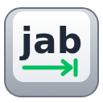

Ctrl+Q tabs to what you want next, using 2MB of gradient-boosted trees from 2016.

> **Mom can we have `tab`?**

> We have `tab` at home.

| Keys | |
|---|---|
| Ctrl+Q | Go to the best guess, badge the top 4 |
| Tap again | Next of the 4 |
| Hold Ctrl+Q + 1-4 | That one |

Anything else you do ends it. Runs locally in ~20 ms; nothing leaves the browser.

Retrain: `uv run train.py data.jsonl.gz ranker.json` (data not included; format and case-study options in `train.py`).

Built on [LightGBM](https://github.com/microsoft/LightGBM) (Microsoft, 2016; Ke et al., NeurIPS 2017), [NumPy](https://numpy.org) and [scikit-learn](https://scikit-learn.org). Training pages labelled by Claude.

MIT License

Copyright (c) 2026 Netanel Haber

Permission is hereby granted, free of charge, to any person obtaining a copy
of this software and associated documentation files (the "Software"), to deal
in the Software without restriction, including without limitation the rights
to use, copy, modify, merge, publish, distribute, sublicense, and/or sell
copies of the Software, and to permit persons to whom the Software is
furnished to do so, subject to the following conditions:

The above copyright notice and this permission notice shall be included in all
copies or substantial portions of the Software.

THE SOFTWARE IS PROVIDED "AS IS", WITHOUT WARRANTY OF ANY KIND, EXPRESS OR
IMPLIED, INCLUDING BUT NOT LIMITED TO THE WARRANTIES OF MERCHANTABILITY,
FITNESS FOR A PARTICULAR PURPOSE AND NONINFRINGEMENT. IN NO EVENT SHALL THE
AUTHORS OR COPYRIGHT HOLDERS BE LIABLE FOR ANY CLAIM, DAMAGES OR OTHER
LIABILITY, WHETHER IN AN ACTION OF CONTRACT, TORT OR OTHERWISE, ARISING FROM,
OUT OF OR IN CONNECTION WITH THE SOFTWARE OR THE USE OR OTHER DEALINGS IN THE
SOFTWARE.

